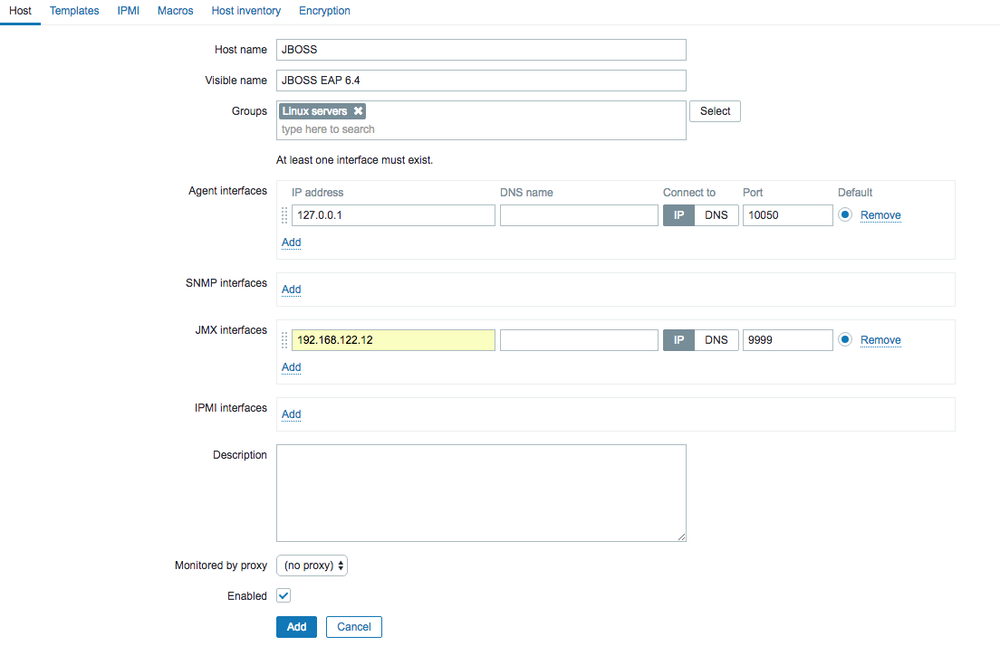
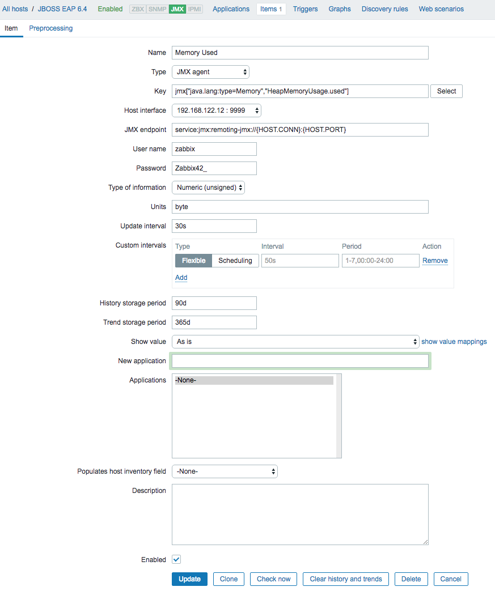

# Configuring Zabbix for JBoss EAP monitoring

## Local environment

Tested with Zabbix 3.2 and JBoss EAP 6.4.

```bash
export VAGRANT_HTTP_PROXY=$HTTP_PROXY
export VAGRANT_HTTPS_PROXY=$HTTPS_PROXY
export VAGRANT_NO_PROXY=$NO_PROXY
vagrant up
```

This environment create 2 hosts:

- `zabbix`: Zabbix server (192.168.122.11)
- `eap`: JBoss EAP 6.4 (192.168.122.12)

Open <http://192.168.122.11/zabbix> and keep all default values. Sign in with `Admin`/`zabbix` and create following Host and Item for testes:




## Create package and configuration

1. After create local environment access `zabbix` host and archive all files needed to Zabbix Java Gateway featured with `remoting-jmx` protocol used by JBOSS:

    ```bash
    vagrant ssh zabbix
    cd /
    tar czvf /vagrant/zabbix-java-gateway.tgz usr/local/sbin/zabbix_java/
    ```

    > File `/vagrant/zabbix-java-gateway.tgz` will be appear in your workspace.

2. Extract this files into Zabbix Server and change `/etc/zabbix/zabbix_java_gateway.conf` with:

    ```diff
    --- zabbix_java_gateway.conf.orig
    +++ zabbix_java_gateway.conf
    @@ -43,3 +43,4 @@
    # TIMEOUT=3

    TIMEOUT=3
    +GATEWAY_HOME=/usr/local/sbin/zabbix_java
    ```

3. Configure Java Gateway in ``/etc/zabbix/zabbix_server.conf``:

    ```ini
    JavaGateway = 127.0.0.1
    StartJavaPollers = 3
    ```

4. Enable ``zabbix-java-gateway`` service

5. Create JBOSS user into environment `eap`

    ```bash
    /opt/jboss-eap-6.4/bin/add-user.sh -u zabbix -p <password>
    ```

6. Configure an Item with JMX

    Example of memory used:

    ```bash
    jmx["java.lang:type=Memory","HeapMemoryUsage.used"]
    ```

## Resources

- [Java Gateway](https://www.zabbix.com/documentation/3.2/manual/concepts/java)
- [Configuring JMX](https://www.zabbix.org/wiki/ConfigureJMX)
- [Configuring Zabbix for JBoss EAP monitoring](https://github.com/puzzle/zabbix-jboss-eap)
- [JBoss EAP 6 monitoring using remoting-jmx and Zabbix](https://www.denniskanbier.nl/blog/monitoring/jboss-eap-6-monitoring-using-remoting-jmx-and-zabbix/)